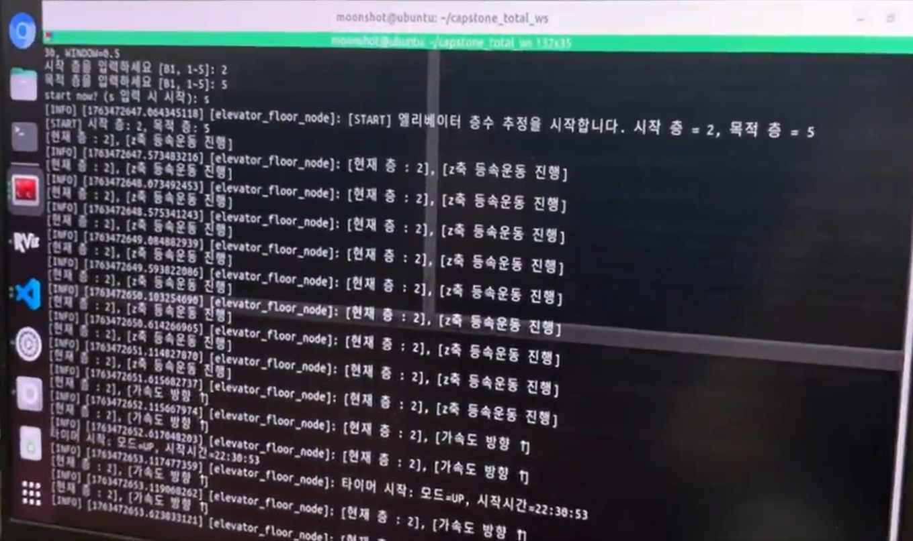

# 11주차 회의록(팀 주간 회의 28차) 20251113

날짜: 2025년 11월 13일
유형: 팀 주간 회의
AI 요약: IMU 센서를 활용한 엘리베이터 층수 추정 기능이 구현되었으며, 가속도 패턴 분석을 통해 정확도를 높였다. 자율주행 로봇의 하드웨어 조립이 완료되어 실제 테스트를 위한 준비가 끝났다. 향후 개선 방향으로는 더 많은 데이터 수집과 알고리즘 신뢰도 향상이 필요하다.
참석자: 한주형, 장윤서, 김형진, 수민 김

## 엘리베이터 층수 추정 및 하드웨어 조립

**1. IMU 기반 엘리베이터 층수 추정 기능 구현**

- 엘리베이터 내부에서 로봇이 자체적으로 현재 층을 추정할 수 있도록, IMU 센서의
    - 퀀터니언(자세)
    - 선가속도(acceleration)
    - 각속도(angular velocity)
        
        데이터를 활용하는 알고리즘을 설계·구현함.
        
- 사용자(또는 로봇)가 탑승층과 목적층을 입력하면,
    - 예: 2층에서 탑승 후 목적층으로 5층을 입력
    - 로봇은 2층을 기준으로 계산을 시작하여, IMU 데이터를 바탕으로 엘리베이터의 움직임을 추적하고
    - 목적층인 5층에 도달했다고 판단되는 시점에 알림을 보내도록 동작하게 구성함.
- 실사용 중 IMU 센서가 매우 민감하고 예민하여, 가속도 값이 순간적으로 튀는(스파이크) 문제가 있었음.
    
    이를 그대로 사용하면 층수 추정이 불안정해지는 문제가 있어, 다음과 같이 보정 로직을 추가함.
    
    - 엘리베이터가 처음 위로 움직이기 시작할 때의 가속도 구간(출발 가속 구간),
    - 일정 속도로 이동하는 등속 구간,
    - 목적층에 도달하며 속도가 줄어드는 감속 및 정지 구간
        
        각각에 대해 시간 구간을 구분하여 분석함.
        
    - 엘리베이터가
        - **1개 층 이동**,
        - **2개 층 이동**,
        - **3개 층 이동**,
        - **4개 층 이동**
            
            **하는 경우를 나누어, 각 경우마다 가속도 패턴과 소요 시간을 실제로 측정·기록함.**
            
    - 이후 IMU에서 들어오는 실시간 데이터를 이 패턴과 비교하여,
        
        현재 몇 개 층을 이동했는지 추정하는 방식으로 정확도를 높임.
        
- 위와 같은 방식으로, 단순히 순간 가속도 값에 의존하지 않고
    
    “구간별 시간 + 가속도 패턴”을 함께 사용함으로써
    
    IMU 값이 튀는 현상이 있더라도 전체 이동 층수 추정이 안정적으로 되도록 개선함.
    
- 현재 상태에서는 입력한 탑승층과 목적층에 대해, 엘리베이터가 실제로 이동한 층수와 로봇의 추정 값이 대체로 일치하는 수준까지 구현을 완료함.
    
    다만, 엘리베이터 모델별/탑승 인원에 따라 미세하게 차이가 나는 부분이 있어, 추후 엘리베이터별 파라미터 튜닝 및 추가 테스트가 필요함.
    
    
    

---

**2. 자율주행 로봇 하드웨어 조립 및 출력 완료**

- 자율주행 로봇의 전체 하드웨어 구성 요소 장착 및 출력(3D 출력 포함)을 완료함.
- 이번 주에 최종적으로 조립한/부착을 마무리한 주요 부품은 다음과 같음.
    - **카메라 모듈**
    - **모터**
    - **모터 드라이버**
    - **IMU 센서**
    - **Jetson Orin Nano 보드**
    - **모니터(디스플레이)**
    - **배터리**
    - **휠 캐스터**
- 각 부품을 로봇 외부/내부에 고정하고, 전원 배선 및 통신 선 연결을 마무리하여
    
    실제로 구동 가능한 형태의 완성된 하드웨어 플랫폼을 구축함.
    
- 이를 통해 다음 주부터는 실제 하드웨어 기반의 자율주행 테스트와
    
    엘리베이터 탑승–이동–하차 시나리오를 통합한 실험을 진행할 수 있는 준비를 마쳤음.
    
    
    

---

**3. 11주차 이슈 및 향후 개선 방향**

- IMU 기반 층수 추정은 기본적인 동작은 가능하지만,
    - 엘리베이터 종류(속도, 가속 패턴),
    - 탑승 인원, 하중 변화
        
        등에 따라 미세한 오차가 발생할 여지가 있음.
        
- 향후에는
    - 더 많은 층 이동 패턴 데이터 수집,
    - 층 간 높이가 다른 엘리베이터에 대한 보정,
    - 필터링/평균화 기법 추가 적용 등을 통해
        
        층수 추정 알고리즘의 신뢰도 향상이 필요함.