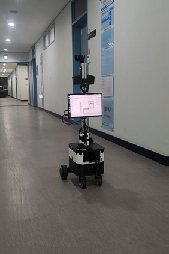
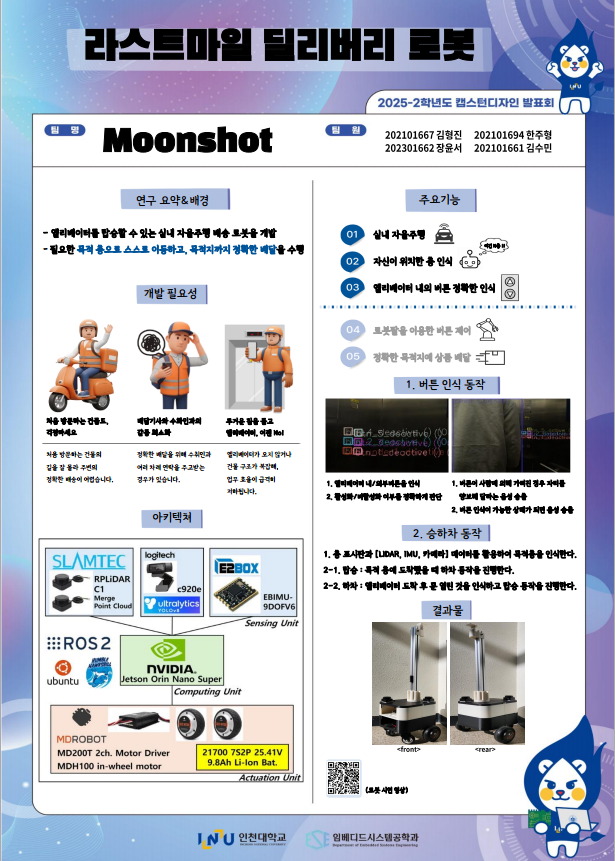

# 12주차 회의록(팀 주간 회의 29차) 20251120

날짜: 2025년 11월 20일
유형: 팀 주간 회의
AI 요약: SLAM 기반 맵 데이터 수집이 완료되었으며, 로봇의 위치 안정화를 위해 TF 튜닝과 odom + 인코더 센서 통합이 이루어졌다. Nav2를 활용한 자율주행 테스트에서 목표 지점까지 안정적으로 도달하는 것을 확인했으나, 엘리베이터 앞/내부의 동적 장애물 회피가 미흡하여 개선이 필요하다. 향후 동적 장애물 인식 및 회피 로직을 보완하고, 시스템을 고도화하여 안전한 자율주행을 목표로 한다.
참석자: 한주형, 장윤서, 김형진, 수민 김

### SLAM 맵 데이터 수집 및 NaV2 Localization 튜닝

**1. SLAM 기반 맵 데이터 수집 완료**

- 로봇이 실제로 주행할 환경에 대해 SLAM을 활용한 맵 데이터 수집을 완료함.
- 로봇을 실제 환경에서 주행시키며 센서 데이터를 취득하고,
    
    SLAM 알고리즘을 실행하여 로봇이 이동할 경로 및 주변 구조가 반영된 2D 맵을 생성함.
    
- 이후 Nav2에서 경로 계획 및 자율주행을 수행할 때,
    
    이 사전 구축된 맵을 기반으로 로컬라이제이션과 경로 계획이 이루어지도록 준비함.
    
    
    
    
    

---

**2. TF 튜닝 및 odom + 인코더 센서 통합**

- 자율주행 시 로봇의 위치가 맵 상에서 틀어지지 않도록,
    
    TF(Transform) 구조를 점검 및 튜닝함.
    
- 특히 다음과 같은 부분을 중점적으로 조정함.
    - odom 프레임과 로봇 본체(base_link) 프레임,
    - 바퀴 인코더 센서로부터 나오는 odometry 정보
        
        간의 관계를 정리하고, 불일치/오차가 나는 부분을 수정함.
        
- 이를 통해,
    - 인코더에서 계산된 odom 정보와
    - SLAM/맵 좌표계에서의 위치 정보가
        
        Nav2 상에서 일관되게 유지되도록 튜닝을 완료함.
        
- 결과적으로, 맵 상에서 로봇의 위치가 점점 밀리거나 돌아가는 현상을 최대한 줄이는 방향으로 로컬라이제이션 안정화 작업을 진행했고,
    
    기본적인 자율주행 시나리오에서 크게 틀어지지 않는 수준까지 정렬을 맞춤.
    

---

**3. Nav2 기반 자율주행 동작 점검**

- 수집한 맵과 튜닝한 TF, odom 정보를 기반으로 Nav2를 활용한 자율주행 테스트를 진행함.
- 목표 지점을 맵 상에 지정했을 때,
    - 로봇이 해당 지점까지 이동하는 경로를 생성하고,
    - 주행 중 odom과 맵 좌표가 크게 어긋나지 않도록
        
        로컬라이제이션이 정상적으로 유지되는지 확인함.
        
- 기본적인 환경(장애물이 적고, 통로가 막히지 않은 상황)에서는
    
    목표 지점까지 비교적 안정적으로 도달하는 것을 확인함.
    
    
    

---

**4. 현재 파악된 문제점 – 엘리베이터 앞/내부의 동적 장애물 대응 미흡**

- 실제 시나리오에서는 엘리베이터 앞이나 내부에 사람이 서 있거나 이동 경로를 가로막는 상황이 자주 발생함.
- 현재 시스템에서는,
    - 사람이 엘리베이터 문 앞을 가로막고 서 있거나,
    - 엘리베이터 내부에서 로봇의 이동 경로를 막고 있는 경우에
        
        로봇이 이를 적절히 회피하지 못하고,
        
    - 문 앞에서 머뭇거리거나, 제자리에서만 계속 움직이며 “헤매는” 듯한 행동을 보이는 문제가 있음.
- 즉, 동적 장애물(사람)에 대한 회피 전략과 복구 동작이 충분히 구현되지 않아,
    
    로봇이 스스로 상황을 해결하지 못하고 바보처럼 멈춰버리는 현상이 발생하고 있음.
    

---

**5. 12주차 기준 향후 개선 방향**

- 엘리베이터 앞/내부의 사람을 포함한 동적 장애물 인식 및 회피 로직 보완 필요.
    - 사람이 일정 시간 이상 로봇의 경로를 막을 경우,
        - 회피 경로를 새로 계획하거나,
        - 일시 대기 후 재시도하는 등
            
            상황별 행동 전략(Behavior)을 세분화할 필요가 있음.
            
- Nav2 쪽에서는
    - 장애물 레이어 설정, 복구 동작(recovery behavior), 회피 전략 등을 조정하여
        
        사람이 있는 상황에서도 로봇이 적절히 대기·우회·재계획을 수행할 수 있도록 개선해야 함.
        
- 이를 통해 최종적으로는
    
    엘리베이터 앞/내부에서도 사람과 함께 안전하게 공존하면서 자율주행이 가능하도록 시스템을 고도화할 계획임.
    

### <캡스톤 디자인 발표회 진행>

